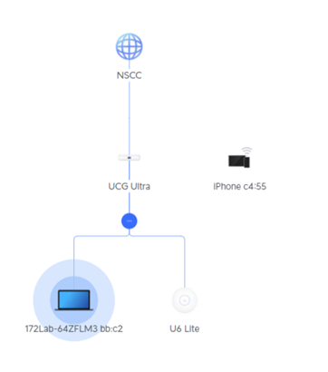
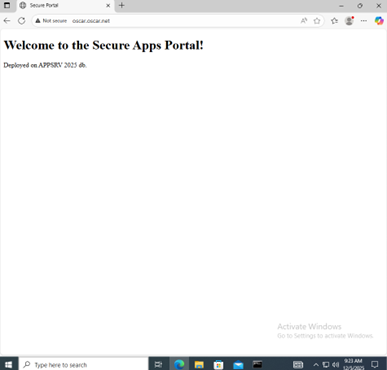
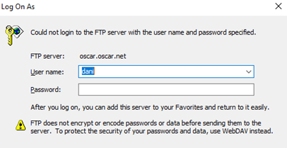
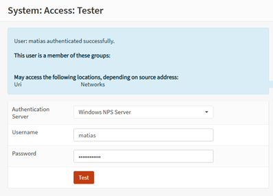
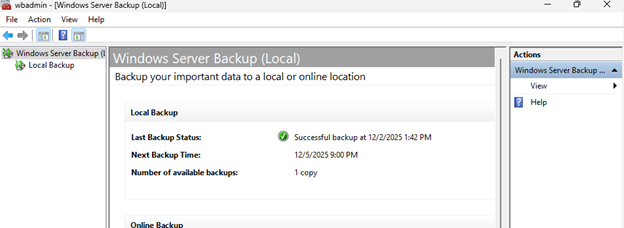
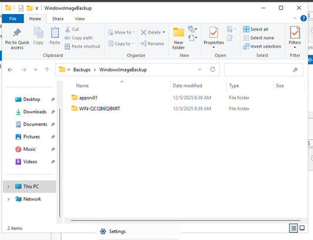

## 📋 Project Overview
This project documents the Phase 1 implementation for the "Expanding Horizons" network infrastructure. The objective was to deploy a secure Windows Server environment featuring Active Directory, DNS, Web Services (IIS), Secure FTP, and RADIUS/NPS authentication, all protected behind an OPNsense firewall.

## 🛠️ Network Architecture
The network uses a centralized logical topology with OPNsense acting as the Gateway and Firewall.

**IP Addressing Scheme:**

| Device | IP Address | Role/Notes |
| :--- | :--- | :--- |
| **OPNsense** | `192.168.1.1` | Gateway / Firewall |
| **DC01** | `192.168.1.2` | Primary DC, DNS, DHCP |
| **DC-BKP** | `192.168.1.3` | Backup DC, DNS Replica |
| **appsrv01** | `192.168.1.161` | Application Server (IIS, FTP, NPS) |
| **Win10 Client** | `192.168.1.45` | DHCP Client |
| **Win11 Client** | `192.168.1.100` | DHCP Client |

* **DHCP Range:** `192.168.1.41 - 192.168.1.245`.
* **DNS Forwarders:** `1.1.1.1, 8.8.8.8`.

## 🔐 Active Directory Design
The `oscar.net` domain is structured into Organizational Units (OUs) to separate management and operations:

* **IT MANAGERS:** Full access to IT resources.
* **EMPLOYEES:** Access to management files and reports.

**Users and Security Groups:**

| Username | Name | Department | OU | Role |
| :--- | :--- | :--- | :--- | :--- |
| **Matias** | Matias | IT MANAGERS | IT MANAGERS | Domain Admin |
| **Cr7** | Ronaldo | IT MANAGERS | IT MANAGERS | General Manager |
| **MS10** | Messi | Sales | EMPLOYEES | Sales User |
| **Jjose** | Jose | Sales | EMPLOYEES | Sales User |
| **Daniel** | Dani | Sales | EMPLOYEES | Sales User |

* **Security Group:** `SG_SecureFTP_Users` (Members: Matias, Ronaldo).

## ⚙️ Services Implemented

### 1. Web Server (IIS)
An internal portal was deployed, accessible via `http://oscar.oscar.net`.

### 2. Secure FTP & FSRM
* **Access Control:** Restricted strictly to the `SG_SecureFTP_Users` group.
* **FSRM Policies:** Uploading `.exe` files is blocked, and storage quotas are enforced.
* **Verification:** Unauthorized users (Jose, Daniel) are denied access.

### 3. RADIUS / NPS
Centralized authentication was configured using NPS. Access tests from OPNsense confirmed success for Admins and failure for standard users.

### 4. Group Policy Objects (GPO)
The following GPOs were applied and verified using `gpresult /r`:
* **Windows Firewall Logging:** Enables logging on servers for traffic monitoring.
* **Common Drive Mapping:** Automatically maps shared folders on `appsrv01`.

## 🛡️ Backup Strategy
Daily scheduled tasks were configured using **Windows Server Backup**:
* **Primary DC:** System State backup to `DC-BKP`.
* **appsrv01:** System State + C: Root backup to `DC-BKP`.
* **Verification:** Backups confirmed as "Successful" on the backup share.

---
*Educational Project - Infrastructure Security*
